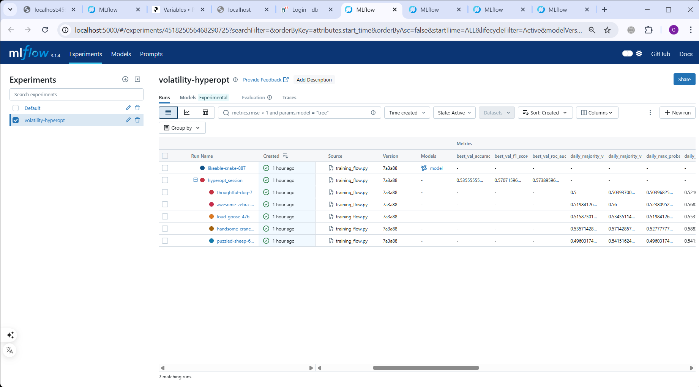
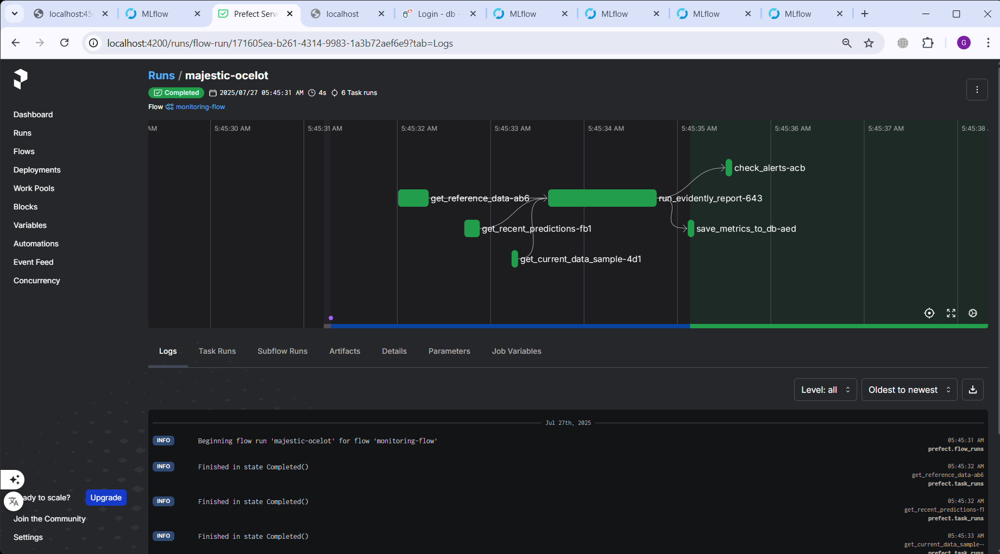

# MLOps Volatility News Predictor

An end-to-end MLOps pipeline for predicting stock market volatility (DJIA) based on news headlines using XGBoost and TF-IDF text analysis.

## 🎯 Project Overview

This project demonstrates modern MLOps practices by building an automated pipeline that:
- **Predicts volatility direction** (up/down) of Dow Jones Industrial Average
- **Processes news headlines** using TF-IDF and historical volatility features  
- **Automates the full ML lifecycle** from training to monitoring
- **Provides both batch scoring and web service** deployment options

**Key Focus:** MLOps automation and best practices, not maximum prediction accuracy.

## 🏗️ Architecture

```
┌─────────────────┐     ┌─────────────────┐    ┌─────────────────┐
│   Data Sources  │───▶│   Prefect       │───▶│   MLflow        │
│   (News + DJIA) │     │   Orchestration │    │   Model Registry│
└─────────────────┘     └─────────────────┘    └─────────────────┘
                                 │                      │
┌─────────────────┐     ┌─────────────────┐    ┌─────────────────┐
│   LocalStack    │◀───┤   4 Prefect     │───▶│   Monitoring    │
│   (S3 Storage)  │     │   Flows         │    │   (Evidently +  │
└─────────────────┘     └─────────────────┘    │   Grafana)      │
                                               └─────────────────┘
```

### 4 Automated Prefect Flows:
1. **`preprocess_flow`** - Data preparation and S3 upload
2. **`training_flow`** - Hyperparameter optimization and model registration  
3. **`scoring_flow`** - Daily batch predictions
4. **`monitoring_flow`** - Weekly model performance monitoring

## 🛠️ Tech Stack

- **Orchestration:** Prefect 2.x
- **ML Tracking:** MLflow (experiments, model registry)
- **Storage:** LocalStack (S3 emulation), MinIO (MLflow artifacts)
- **Monitoring:** Evidently, PostgreSQL, Grafana
- **ML Stack:** XGBoost, scikit-learn, pandas, hyperopt
- **Infrastructure:** Docker Compose, GitHub Actions
- **Quality:** pytest, black, isort, pylint, pre-commit

## 📊 Data & Model

**Dataset:** [Daily News for Stock Market Prediction](https://www.kaggle.com/datasets/aaron7sun/stocknews)
- **Time Period:** 2008-2016 (8 years)
- **Format:** 25 daily news headlines + DJIA historical prices
- **Target:** Binary volatility direction (increase/decrease)

**Model Architecture:**
- **Text Features:** TF-IDF vectorization (1000 features, 1-2 grams)
- **Numeric Features:** Historical volatility lags and moving averages
- **Algorithm:** XGBoost classifier with hyperparameter optimization
- **Aggregation:** Multiple daily prediction methods (mean, majority, max)

**Performance:** ~52-54% accuracy, ~0.54-0.55 AUC (realistic for volatility prediction)

## 🚀 Quick Start

### 1. Prerequisites
- Docker & Docker Compose
- Python 3.9+
- Git

### 2. Setup Environment

```bash
# Clone repository
git clone <repository-url>
cd mlops-volatility-news-predictor

# Create environment file
cp .env.example .env

# Install dependencies
pipenv install --dev

# Start infrastructure
make up
# or: docker compose up -d
```

### 3. Access Services
- **Prefect UI:** http://localhost:4200
- **MLflow UI:** http://localhost:5000  
- **Grafana:** http://localhost:3000
- **PostgreSQL:** localhost:5432

### 4. Run Pipelines

```bash
# Activate environment
pipenv shell

# 1. Prepare data (run once)
python flows/preprocess_flow.py

# 2. Train model (manual trigger)
python flows/training_flow.py

# 3. Promote model to Production (via MLflow UI)
# Go to http://localhost:5000 → Models → volatility-classifier
# Select latest version → Transition to "Production"

# 4. Run daily scoring
python flows/scoring_flow.py

# 5. Run weekly monitoring
python flows/monitoring_flow.py
```

## 📁 Project Structure

```
mlops-volatility-news-predictor/
├── data/
│   ├── processed/          # Ready-to-use datasets
│   │   ├── train_tall.parquet (33k rows, 2008-2013)
│   │   ├── val_tall.parquet   (6k rows, 2014)
│   │   └── test_tall.parquet  (9k rows, 2015-2016)
│   └── raw/               # Original datasets
├── src/                   # Core business logic
│   ├── preprocess.py      # Data transformation functions
│   ├── train.py           # Model training & hyperopt
│   ├── predict.py         # Prediction functions
│   └── utils.py           # S3 and utility functions
├── flows/                 # Prefect workflows
│   ├── preprocess_flow.py
│   ├── training_flow.py
│   ├── scoring_flow.py
│   └── monitoring_flow.py
├── tests/                 # Unit & integration tests
├── research/              # Jupyter notebooks
├── monitoring/            # Grafana dashboards
└── webservice/           # FastAPI service (Stage 2)
```

## 🔄 MLOps Workflow

### Data Pipeline
1. **Historical data** already processed in "tall" format (1 row = 1 headline + features)
2. **S3 storage** via LocalStack for data versioning
3. **Feature engineering** includes volatility lags, moving averages, calendar features

### Model Pipeline  
1. **Hyperparameter optimization** using Hyperopt (20-50 trials)
2. **Cross-validation** on train/val split with temporal ordering
3. **Model registration** in MLflow with automatic staging
4. **Manual promotion** to Production stage

### Prediction Pipeline
1. **Daily batch scoring** from Production model
2. **Multi-method aggregation** (mean probability, majority vote, max confidence)
3. **Results storage** in S3 with metadata tracking

### Monitoring Pipeline
1. **Weekly Evidently reports** comparing current vs reference data
2. **Data/prediction drift detection** with configurable thresholds
3. **Model performance tracking** (AUC, F1-score) over time
4. **Grafana alerts** for model degradation

## 📈 Monitoring & Maintenance

### Key Metrics Tracked:
- **Data Drift:** Feature distribution changes
- **Prediction Drift:** Output distribution changes  
- **Model Performance:** AUC, F1-score, accuracy
- **Operational:** Prediction latency, error rates

### Alert Thresholds:
- **AUC < 0.52** → Retrain model
- **Data drift > 0.3** → Investigate data quality
- **Prediction error rate > 5%** → Check infrastructure

### Retraining Process:
1. Monitor triggers alert in Grafana
2. Manually run `training_flow` 
3. Evaluate new model performance
4. Promote to Production if better
5. Update monitoring baselines

## 🧪 Testing

```bash
# Run all tests
make test

# Run specific test categories  
pipenv run pytest tests/unit/
pipenv run pytest tests/integration/

# Code quality checks
make lint
```

## 🚀 Stage 2: Web Service

The project architecture supports easy extension to a FastAPI web service:

```python
# webservice/main.py
@app.post("/predict")
async def predict_headline(request: PredictionRequest):
    model, vectorizer, version = load_production_model()
    result = predict_one(request.headline, model)
    return {"prediction": result, "model_version": version}
```

## 📸 Screenshots

### MLflow Model Registry


### Prefect Flow Runs  


### Grafana Monitoring Dashboard


## 🤝 Contributing

1. Fork the repository
2. Create feature branch (`git checkout -b feature/amazing-feature`)
3. Commit changes (`git commit -m 'Add amazing feature'`)
4. Push to branch (`git push origin feature/amazing-feature`)
5. Open Pull Request

## 📄 License

This project is licensed under the MIT License - see the [LICENSE](LICENSE) file for details.

## 🙏 Acknowledgments

- [MLOps Zoomcamp](https://github.com/DataTalksClub/mlops-zoomcamp) for the educational framework
- [Kaggle Stock News Dataset](https://www.kaggle.com/datasets/aaron7sun/stocknews) for the data
- Open source ML/MLOps community for excellent tools
