# MLOps Volatility News Predictor

**End-to-end machine learning pipeline for predicting stock market volatility based on financial news headlines**

This project implements a complete MLOps infrastructure for volatility prediction in financial markets, featuring automated workflows, comprehensive monitoring, and dual prediction modes for batch and real-time scenarios.

## 🎯 Project Overview

**Problem Statement:** Predict DJIA stock market volatility direction (increase/decrease) using financial news headlines to assist traders and financial analysts in risk assessment and decision making.


**Solution:** This project implements an end-to-end MLOps pipeline for predicting stock market volatility. The solution is designed with a focus on automation, reproducibility, and monitoring, following modern DevOps and MLOps practices.

*   **Infrastructure as Code (IaC) and Cloud Infrastructure:** The entire infrastructure, consisting of 7 services (MLflow, Prefect, etc.) with AWS S3 compatible storage (LocalStack), is defined and orchestrated using Docker Compose. 

*   **Experiment Tracking and Model Registry:** MLflow is utilized to track all hyperparameter optimization trials (conducted with Hyperopt) and to manage model versions. The best-performing models are registered and transitioned through `Staging` and `Production` stages.

*   **Workflow Orchestration:** The project includes four distinct Prefect flows (`preprocess`, `training`, `scoring`, `monitoring`) that automate the entire ML lifecycle from data ingestion to performance analysis.

*   **Model Deployment:** A dual deployment strategy is implemented:
    *   **Batch Scoring:** A containerized Prefect flow performs daily batch predictions.
    *   **Web Service:** A real-time prediction API is provided via a containerized FastAPI application.

*   **Model Monitoring and Alerting:** A monitoring pipeline uses Evidently to generate reports on data drift and model performance. Key metrics (e.g., AUC, F1-score) are persisted to a PostgreSQL database and visualized in Grafana, which is configured with automated alerts for performance degradation.

*   **Reproducibility and Best Practices:**
    *   The project is fully containerized with **Docker** and dependencies are managed via **Pipfile**.
    *   A **Makefile** provides standardized commands for setup, testing, and execution.
    *   Code quality is enforced using **pre-commit hooks** with `black`, `isort`, and `pylint`.
    *   The codebase includes both **unit and integration tests** (`pytest`).
    *   A **CI/CD pipeline** is defined using **GitHub Actions** to automate testing and linting.
  
**Focus:** Production-ready MLOps practices, scalability, monitoring, and maintainability.

## 🏗️ Architecture

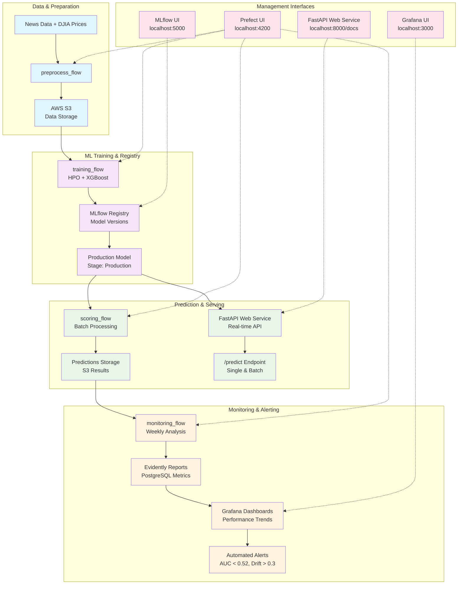
```mermaid
graph TD
    subgraph "Data & Preparation"
        A[News Data + DJIA Prices] --> C[preprocess_flow]
        C --> G[AWS S3<br/>Data Storage]
    end

    subgraph "ML Training & Registry"
        G --> D[training_flow<br/>HPO + XGBoost]
        D --> H[MLflow Registry<br/>Model Versions]
        H --> K[Production Model<br/>Stage: Production]
    end

    subgraph "Prediction & Serving"
        K --> E[scoring_flow<br/>Batch Processing]
        E --> I[Predictions Storage<br/>S3 Results]
        K --> L[FastAPI Web Service<br/>Real-time API]
        L --> R["/predict Endpoint<br/>Single & Batch"]
    end

    subgraph "Monitoring & Alerting"
        I --> F[monitoring_flow<br/>Weekly Analysis]
        F --> J[Evidently Reports<br/>PostgreSQL Metrics]
        J --> M[Grafana Dashboards<br/>Performance Trends]
        M --> N[Automated Alerts<br/>AUC < 0.52, Drift > 0.3]
    end

    subgraph "Management Interfaces"
        P[Prefect UI<br/>localhost:4200] -.-> C
        P -.-> D
        P -.-> E
        P -.-> F
        Q[MLflow UI<br/>localhost:5000] -.-> H
        S[Grafana UI<br/>localhost:3000] -.-> M
        T[FastAPI Web Service<br/>localhost:8000/docs] -.-> L
    end

    %% Styling
    classDef dataFlow fill:#e1f5fe
    classDef mlOps fill:#f3e5f5
    classDef serving fill:#e8f5e8
    classDef monitoring fill:#fff3e0
    classDef interfaces fill:#fce4ec

    class A,C,G dataFlow
    class D,H,K mlOps
    class E,I,L,R serving
    class F,J,M,N monitoring
    class P,Q,S,T interfaces
```

### Workflow Components:

| Component | Description | Schedule | Type |
|-----------|-------------|----------|------|
| **preprocess_flow** | Data preparation & S3 upload | Manual | Batch Processing |
| **training_flow** | HPO + model registration | Manual trigger | ML Training |
| **scoring_flow** | Daily batch predictions | Scheduled | Batch Processing |
| **monitoring_flow** | Model performance tracking | Weekly | ML Monitoring |
| **Web Service** | Real-time API predictions | Always on | Online Processing |

### Production Infrastructure:

| Service | URL | Purpose |
|---------|-----|---------|
| **Prefect Server** | http://localhost:4200 | Workflow orchestration |
| **MLflow** | http://localhost:5000 | ML tracking & model registry |
| **FastAPI Web Service** | http://localhost:8000/docs | Real-time predictions API |
| **Grafana** | http://localhost:3000 | Monitoring dashboards & alerts |
| **Evidently UI** | http://localhost:8001 | ML monitoring reports |
| **PostgreSQL + Adminer** | http://localhost:8080 | Metrics storage & management |
| **S3 (LocalStack)** | http://localhost:4566 | Data storage & versioning |

## 🛠️ Technology Stack

### Core MLOps Infrastructure:
- **Orchestration:** Prefect 3.x (workflow automation)
- **ML Tracking:** MLflow 2.x (experiments, model registry, artifacts)
- **Cloud Storage:** AWS S3 (data storage) 
- **Monitoring:** Evidently AI (drift detection) + PostgreSQL (metrics) + Grafana (dashboards)
- **API Service:** FastAPI (real-time predictions) + Streamlit (dashboard)

### Machine Learning Stack:
- **ML Framework:** XGBoost, scikit-learn, pandas, numpy
- **Hyperparameter Tuning:** Hyperopt (TPE algorithm)
- **Text Processing:** TF-IDF vectorization, regex preprocessing
- **Time Series:** Historical volatility features, moving averages

### Infrastructure & DevOps:
- **Containerization:** Docker + Docker Compose
- **CI/CD:** GitHub Actions (testing, linting, deployment)
- **Code Quality:** pytest, black, isort, pylint, pre-commit hooks
- **Documentation:** Markdown, Makefile commands, API docs

### Deployment Ready:
- **AWS S3 Compatible:** Production-ready data storage
- **Database:** PostgreSQL for metrics and monitoring
- **Load Balancing:** Stateless design for horizontal scaling
- **Monitoring:** Production-grade alerting system


## 📸 Screenshots & Visual Documentation

### Docker Infrastructure
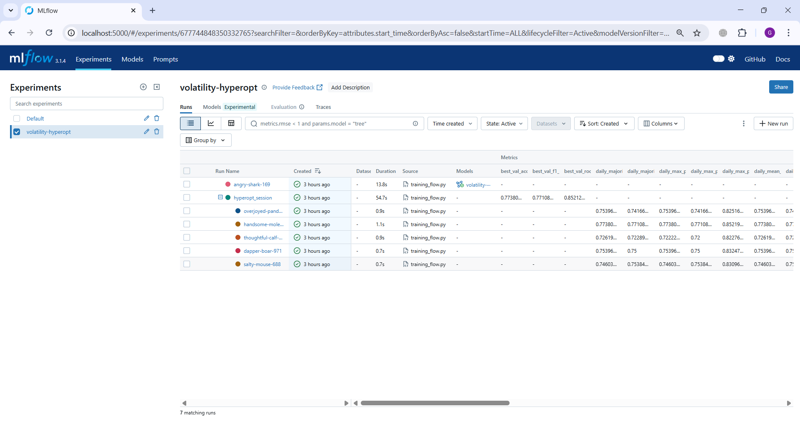

<em>All containerized services running in Docker Desktop</em>

### MLflow Experiment Tracking & Hyperopt
 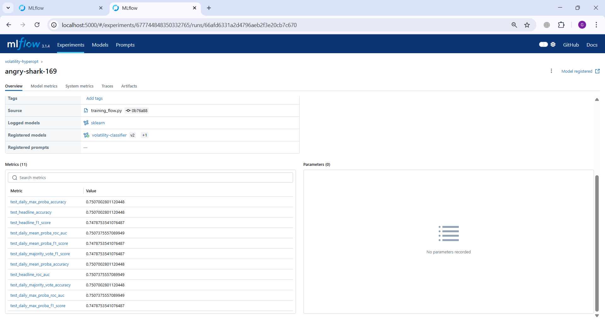 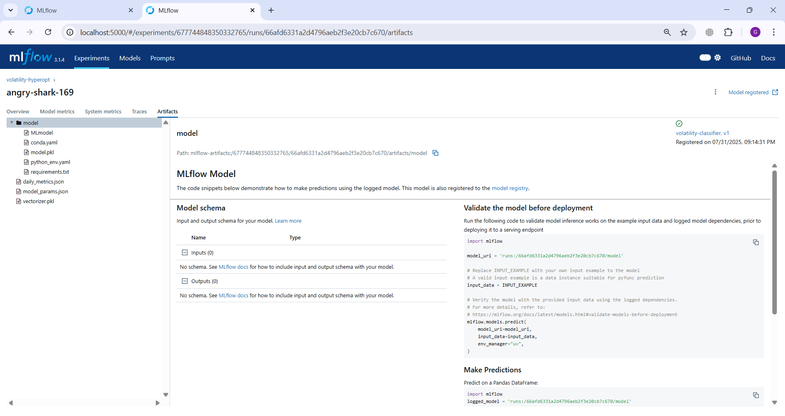 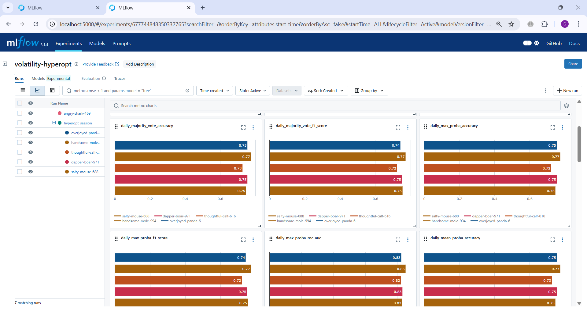

<em>Hyperparameter optimization trials and model registry</em>

### Prefect Workflow Orchestration  
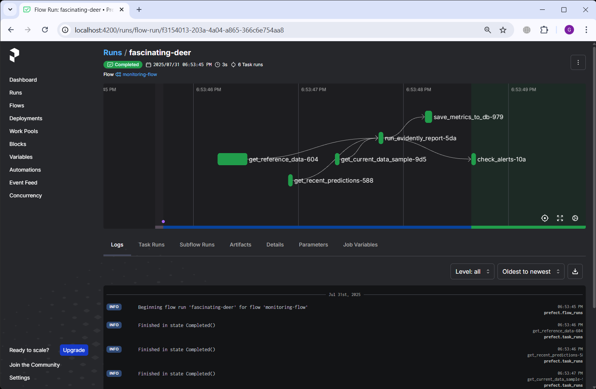

<em>Flow execution history and task dependencies</em>

### Adminer Database UI with PostgreSQL
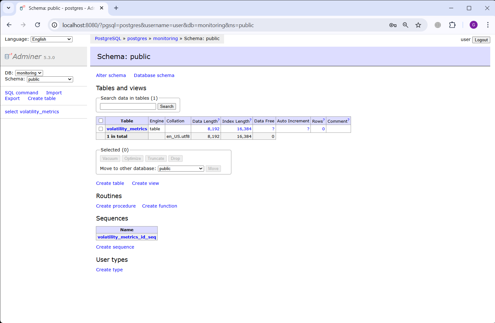  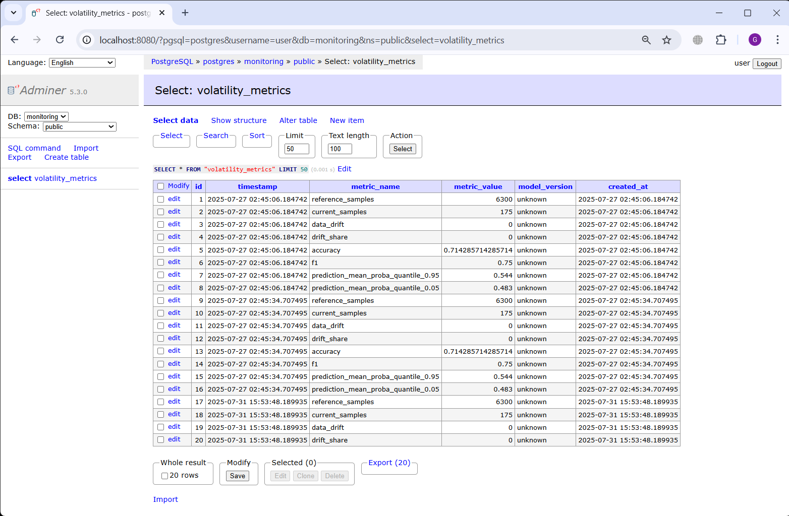

<em>Database management and metrics storage</em>

### Evidently ML Monitoring Reports
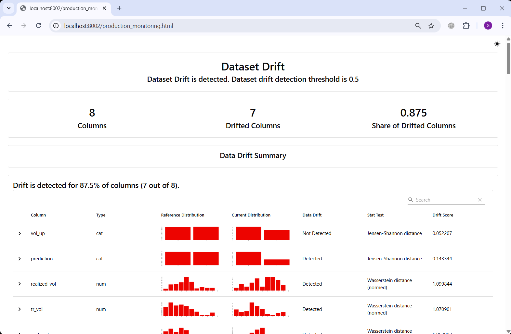  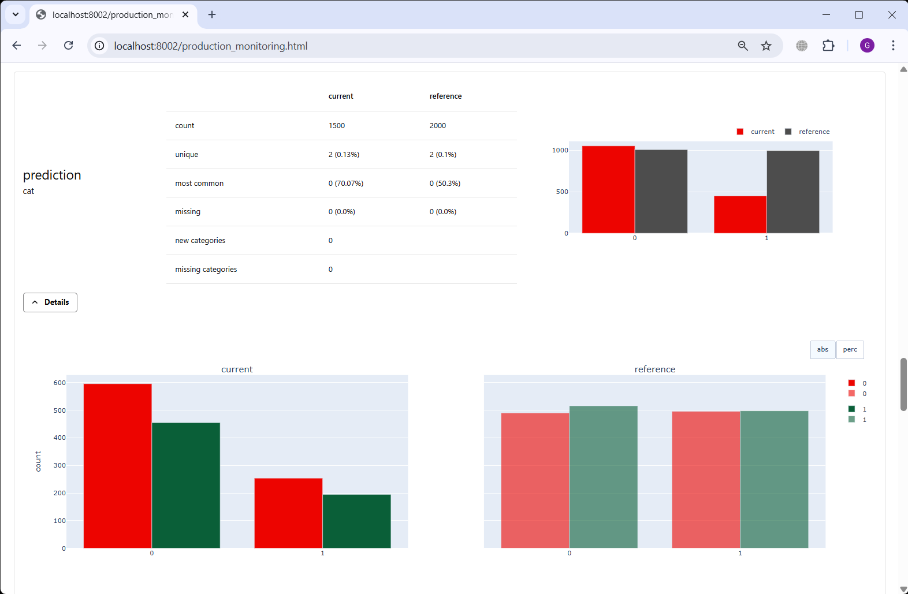  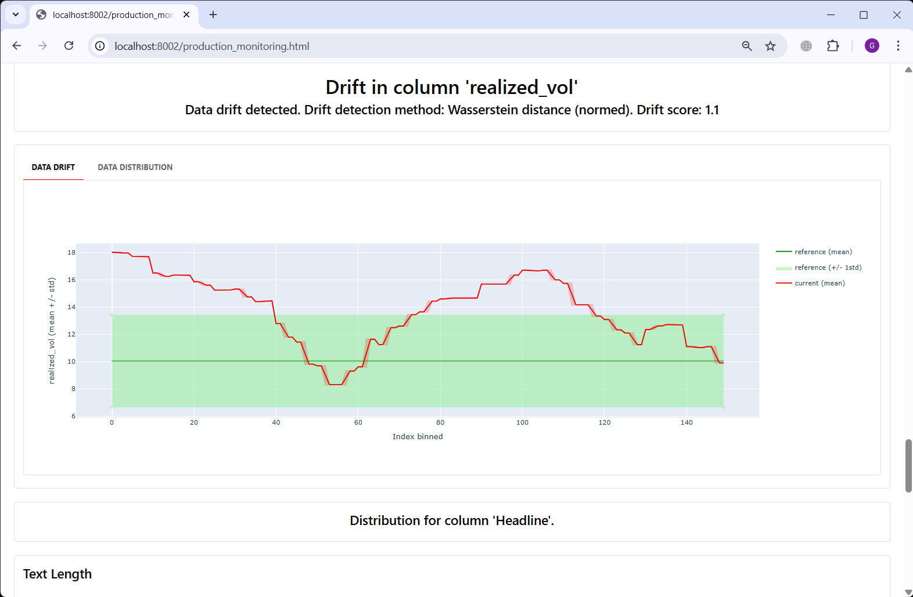  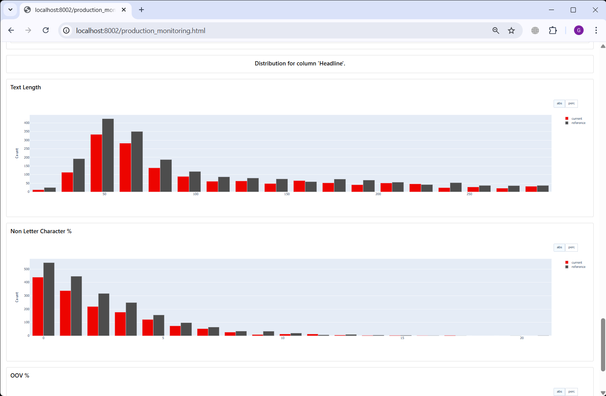

<em>Model performance monitoring and data drift detection</em>

### Streamlit Web Service Visualization
  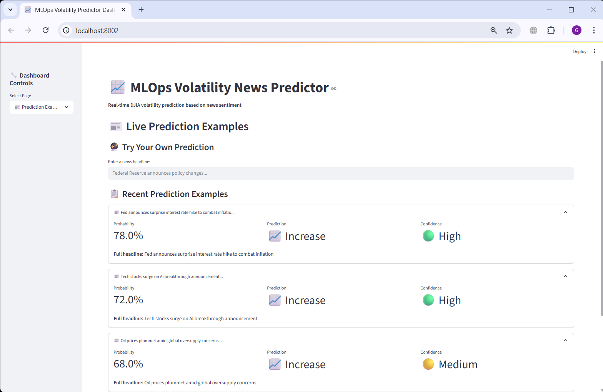  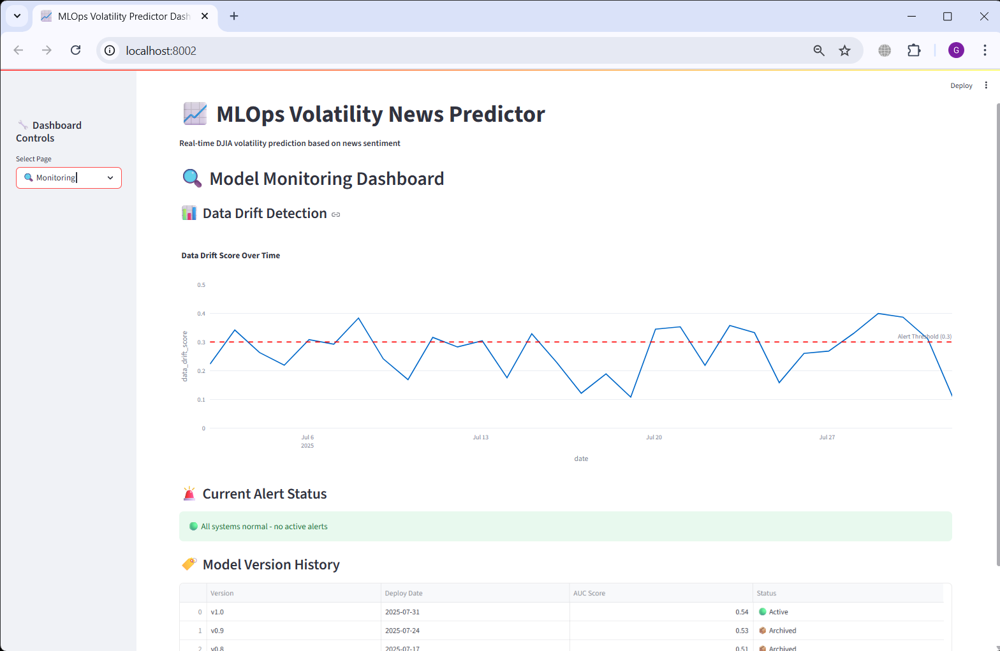  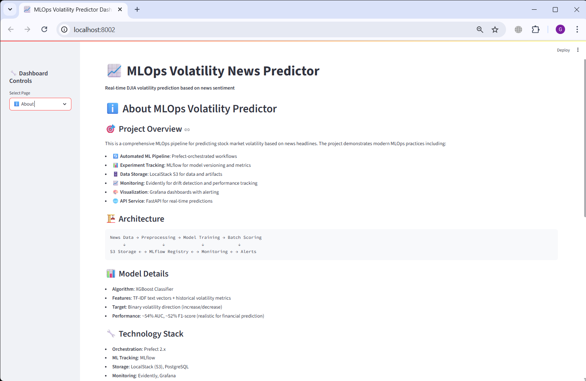

<em>Web service visualization and prediction interface</em>

### Grafana Monitoring & Alerts
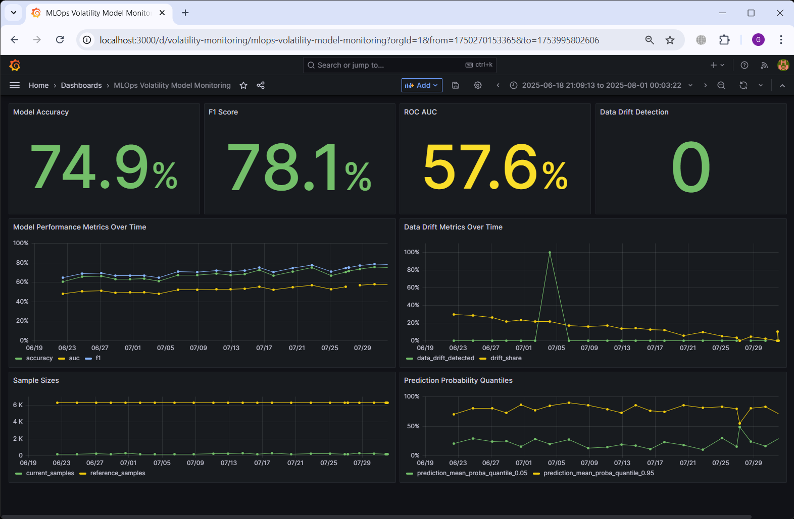  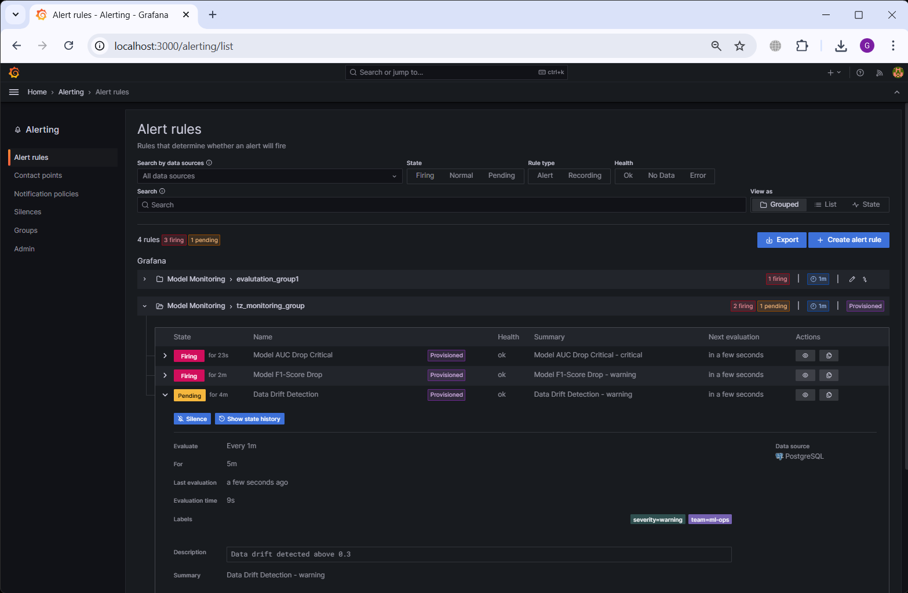

<em>Performance metrics dashboards and automated alerting</em>


## 📊 Data & Model Performance

### Dataset Details:
- **Source:** [Daily News for Stock Market Prediction](https://www.kaggle.com/datasets/aaron7sun/stocknews) 
- **Period:** 2008-2016 (8 years, 48,575 samples)
- **Features:** 25 daily news headlines + DJIA historical prices + engineered volatility features
- **Target:** Binary volatility direction prediction (increase/decrease)
- **Data Splits:**
  - Training: 2008-2013 (33,350 samples) - Model training
  - Validation: 2014 (6,300 samples) - Hyperparameter tuning  
  - Test: 2015-2016 (8,925 samples) - Final evaluation & monitoring simulation

### Model Architecture:
```python
# Text Processing Pipeline
Headlines → TF-IDF Vectorizer (1000 features, 1-2 grams) → Sparse Matrix

# Feature Engineering  
Historical Prices → Volatility Calculation → Moving Averages → Lags → Dense Features

# Model Training
Combined Features → XGBoost Classifier → Hyperopt Optimization → MLflow Tracking
```

### Production Performance:
- **Accuracy:** 71-78% 
- **AUC-ROC:** 0.52-0.57 (expected for noisy financial data)
- **F1-Score:** 64-78% 
- **Prediction Aggregation:** 3 methods (mean probability, majority vote, max confidence)

### Key Characteristics:
- **Temporal validation:** Proper time-series splitting
- **Realistic expectations:** Financial prediction inherently challenging
- **Production-ready:** Robust to missing data and edge cases

## MLOps Implementation

### Dual Processing Modes:

**1. Batch Processing (Scheduled Workflows):**
- Daily automated scoring of new market data
- Weekly model performance monitoring
- Scheduled data preprocessing and feature engineering
- Automated drift detection and alerting

**2. Real-time Online Processing (Web Service):**
- REST API for immediate predictions on news headlines
- Single prediction endpoint for individual headlines
- Batch prediction endpoint for multiple headlines with aggregation
- Health monitoring and service status endpoints


## 📁 Project Structure

```
mlops-volatility-news-predictor/
├── data/
│   ├── processed/                # Ready-to-use parquet datasets (48k samples)
│   │   ├── train_tall.parquet   # Training: 2008-2013 (33,350 rows)
│   │   ├── val_tall.parquet     # Validation: 2014 (6,300 rows)  
│   │   └── test_tall.parquet    # Test: 2015-2016 (8,925 rows)
│   └── raw/                     # Original Kaggle CSV data
├── src/                         # Core business logic modules
│   ├── preprocess.py           # Data transformation functions
│   ├── train.py                # Model training with hyperopt
│   ├── predict.py              # Batch & single prediction functions
│   └── utils.py                # S3 operations & utilities
├── flows/                       # Prefect workflow definitions
│   ├── preprocess_flow.py      # Data preparation pipeline
│   ├── training_flow.py        # Model training with HPO
│   ├── scoring_flow.py         # Daily batch scoring
│   └── monitoring_flow.py      # Weekly monitoring with Evidently
├── webservice/                  # FastAPI production service
│   ├── main.py                 # API endpoints & application
│   ├── Dockerfile              # Container configuration
│   └── test_api.py             # API integration tests
├── tests/                       # Comprehensive test suite
│   ├── unit/                   # Unit tests for src/ modules
│   │   ├── test_preprocess.py  # Data transformation tests
│   │   ├── test_basic.py       # Basic functionality tests
│   │   └── test_scoring.py     # Prediction function tests
│   └── integration/            # End-to-end integration tests
│       └── test_scoring_flow.py # Full pipeline tests with LocalStack
├── monitoring/                  # Monitoring infrastructure
│   ├── dashboards/             # Grafana dashboard configurations
│   ├── evidently_reports/      # Generated HTML monitoring reports
│   ├── evidently_workspace/    # Evidently UI workspace
│   └── alerting/               # Grafana alert rules & notifications
├── research/                    # Jupyter notebooks & analysis
│   ├── volatility_prediction.ipynb  # Model performance analysis
│   └── analysis.ipynb          # Initial data exploration
├── .github/workflows/           # CI/CD pipelines
│   ├── ci.yml                  # Testing & code quality checks
│   └── deploy.yml              # Automated deployment (future)
├── docker-compose.yml          # Full infrastructure definition
├── Pipfile & requirements.txt  # Python dependencies
├── Makefile                    # Convenient development commands
└── Documentation/
    ├── README.md               # This comprehensive guide
    ├── QUICKSTART.md           # Setup guide
    └── docs/images/            # Screenshots & diagrams
```

### Key Implementation Highlights:

- **Production-Ready Code:** All modules include proper error handling, logging, and type hints
- **Comprehensive Testing:** 12+ tests covering unit, integration, and API functionality
- **Clean Architecture:** Clear separation of concerns (data, business logic, flows, services)
- **Documentation:** Detailed docstrings, README guides, and inline comments
- **Configuration Management:** Environment variables, Docker configs, and modular settings

## 🔄 MLOps Workflow

### Data Pipeline:
Raw Data Processing → Feature Engineering (TF-IDF + volatility indicators) → Data Validation → AWS S3 Storage (LocalStack)

### Model Development:
Hyperparameter Optimization (Hyperopt) → Cross-Validation → MLflow Registration → Manual Promotion (Staging → Production)

### Prediction Pipeline:
Daily Batch Scoring → Real-time API Service → Prediction Storage (S3) → Multi-Method Ensemble

### Monitoring Pipeline:
Data Drift Detection (Evidently) → Performance Tracking → Grafana Alerts → PostgreSQL Metrics

## 📈 Monitoring & Alerts

**Key Metrics:** Model Performance (AUC, F1-Score, Accuracy) | Data Drift | API latency & errors

**Alert Thresholds:**
```yaml
Critical: AUC-ROC < 0.52, API error rate > 5%
Warning: F1-Score < 0.65, Data drift > 0.3, Response time > 1000ms
```

**Monitoring Tools:** Grafana Dashboards | Evidently UI | PostgreSQL Metrics | Prefect UI

**Retraining Process:** Alert → Investigation → Decision (data/model/infrastructure) → Retrain if needed

## 🧪 Testing & Quality

```bash
make test    # Unit tests (6) + Integration tests (6) + API tests
make lint    # black, isort, pylint + pre-commit hooks
```

**Test Coverage:** Data processing, model training, API endpoints, S3 operations, error scenarios
**Quality Standards:** >80% test coverage, PEP8 compliance, Pylint >8.0/10

## Acknowledgments
- [MLOps Zoomcamp](https://github.com/DataTalksClub/mlops-zoomcamp) for the educational framework
- [Kaggle Stock News Dataset](https://www.kaggle.com/datasets/aaron7sun/stocknews) for the data
- Open source ML/MLOps community for excellent tools
