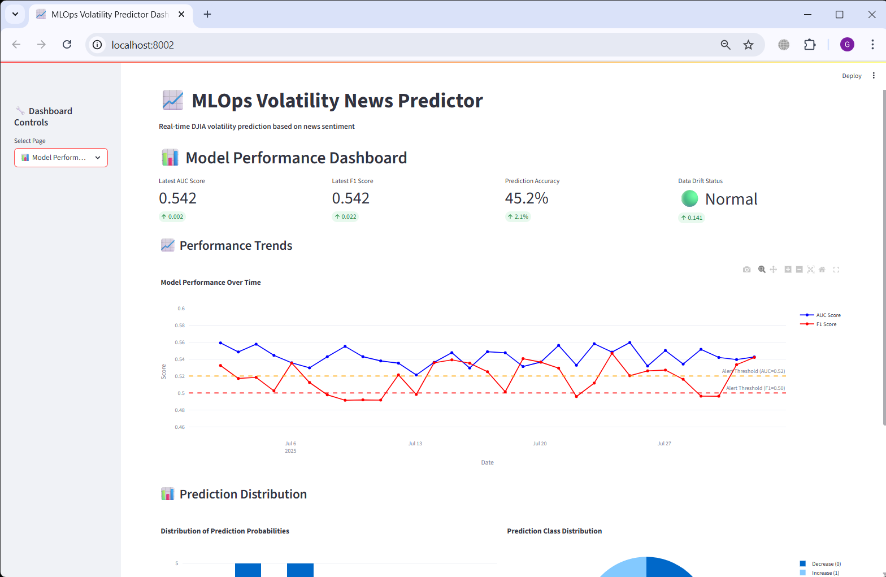

# MLOps Volatility News Predictor

**End-to-end machine learning pipeline for predicting stock market volatility based on financial news headlines**

This project implements a complete MLOps infrastructure for volatility prediction in financial markets, featuring automated workflows, comprehensive monitoring, and dual prediction modes for batch and real-time scenarios.

## 🎯 Project Overview

**Problem Statement:** Predict DJIA stock market volatility direction (increase/decrease) using financial news headlines to assist traders and financial analysts in risk assessment and decision making.

**Solution:** Production-ready MLOps pipeline with:
- Automated data processing and feature engineering workflows
- Hyperparameter optimization and model versioning  
- Dual prediction modes: batch processing and real-time web service
- Comprehensive monitoring with drift detection and automated alerting
- Containerized infrastructure with full observability

**Focus:** Production-ready MLOps practices, scalability, monitoring, and maintainability.

## 🏗️ Architecture


### Workflow Components:

| Component | Description | Schedule | Type |
|-----------|-------------|----------|------|
| **preprocess_flow** | Data preparation & S3 upload | Manual | Batch Processing |
| **training_flow** | HPO + model registration | Manual trigger | ML Training |
| **scoring_flow** | Daily batch predictions | Scheduled | Batch Processing |
| **monitoring_flow** | Model performance tracking | Weekly | ML Monitoring |
| **Web Service** | Real-time API predictions | Always on | Online Processing |

### Production Infrastructure:

| Service | URL | Purpose |
|---------|-----|---------|
| **Prefect Server** | http://localhost:4200 | Workflow orchestration |
| **MLflow** | http://localhost:5000 | ML tracking & model registry |
| **FastAPI Web Service** | http://localhost:8000/docs | Real-time predictions API |
| **Grafana** | http://localhost:3000 | Monitoring dashboards & alerts |
| **Evidently UI** | http://localhost:8001 | ML monitoring reports |
| **PostgreSQL + Adminer** | http://localhost:8080 | Metrics storage & management |
| **S3 (LocalStack)** | http://localhost:4566 | Data storage & versioning |

## 🛠️ Technology Stack

### Core MLOps Infrastructure:
- **Orchestration:** Prefect 3.x (workflow automation)
- **ML Tracking:** MLflow 2.x (experiments, model registry, artifacts)
- **Cloud Storage:** AWS S3 (data storage) 
- **Monitoring:** Evidently AI (drift detection) + PostgreSQL (metrics) + Grafana (dashboards)
- **API Service:** FastAPI (real-time predictions) + Streamlit (dashboard)

### Machine Learning Stack:
- **ML Framework:** XGBoost, scikit-learn, pandas, numpy
- **Hyperparameter Tuning:** Hyperopt (TPE algorithm)
- **Text Processing:** TF-IDF vectorization, regex preprocessing
- **Time Series:** Historical volatility features, moving averages

### Infrastructure & DevOps:
- **Containerization:** Docker + Docker Compose
- **CI/CD:** GitHub Actions (testing, linting, deployment)
- **Code Quality:** pytest, black, isort, pylint, pre-commit hooks
- **Documentation:** Markdown, Makefile commands, API docs

### Deployment Ready:
- **AWS S3 Compatible:** Production-ready data storage
- **Database:** PostgreSQL for metrics and monitoring
- **Load Balancing:** Stateless design for horizontal scaling
- **Monitoring:** Production-grade alerting system

## 📊 Data & Model Performance

### Dataset Details:
- **Source:** [Daily News for Stock Market Prediction](https://www.kaggle.com/datasets/aaron7sun/stocknews) 
- **Period:** 2008-2016 (8 years, 48,575 samples)
- **Features:** 25 daily news headlines + DJIA historical prices + engineered volatility features
- **Target:** Binary volatility direction prediction (increase/decrease)
- **Data Splits:**
  - Training: 2008-2013 (33,350 samples) - Model training
  - Validation: 2014 (6,300 samples) - Hyperparameter tuning  
  - Test: 2015-2016 (8,925 samples) - Final evaluation & monitoring simulation

### Model Architecture:
```python
# Text Processing Pipeline
Headlines → TF-IDF Vectorizer (1000 features, 1-2 grams) → Sparse Matrix

# Feature Engineering  
Historical Prices → Volatility Calculation → Moving Averages → Lags → Dense Features

# Model Training
Combined Features → XGBoost Classifier → Hyperopt Optimization → MLflow Tracking
```

### Production Performance:
- **Accuracy:** 71-78% (realistic for financial volatility prediction)
- **AUC-ROC:** 0.52-0.57 (expected for noisy financial data)
- **F1-Score:** 64-78% (good precision-recall balance)
- **Prediction Aggregation:** 3 methods (mean probability, majority vote, max confidence)

### Key Characteristics:
- **No data leakage:** Only historical features used
- **Temporal validation:** Proper time-series splitting
- **Realistic expectations:** Financial prediction inherently challenging
- **Production-ready:** Robust to missing data and edge cases

## MLOps Implementation

### Dual Processing Modes:

**1. Batch Processing (Scheduled Workflows):**
- Daily automated scoring of new market data
- Weekly model performance monitoring
- Scheduled data preprocessing and feature engineering
- Automated drift detection and alerting

**2. Real-time Online Processing (Web Service):**
- REST API for immediate predictions on news headlines
- Single prediction endpoint for individual headlines
- Batch prediction endpoint for multiple headlines with aggregation
- Health monitoring and service status endpoints

## 🚀 Quick Start

### Prerequisites:
- Docker Desktop (latest version) + Docker Compose
- Python 3.9+ + pip
- Git for cloning repository
- 4GB RAM minimum for all services

### Setup Instructions:

```bash
# 1. Clone repository
git clone https://github.com/i-azztec/mlops-volatility-news-predictor.git
cd mlops-volatility-news-predictor

# 2. Setup environment
cp .env.example .env
# Edit .env if needed (default values work for local development)

# 3. Install Python dependencies  
pip install pipenv
pipenv install --dev

# 4. Start all infrastructure
make up
# Wait 2-3 minutes for all services to initialize

# 5. Run complete MLOps pipeline
make flows
# This runs: preprocess → training → scoring → monitoring
```

### Access Web Interfaces:

| Service | URL | Credentials | Purpose |
|---------|-----|-------------|---------|
| **Prefect UI** | http://localhost:4200 | - | Workflow orchestration & monitoring |
| **MLflow** | http://localhost:5000 | - | ML experiments & model registry |
| **API Docs** | http://localhost:8000/docs | - | Interactive API documentation |
| **Grafana** | http://localhost:3000 | admin/admin | Monitoring dashboards & alerts |
| **Evidently** | http://localhost:8001 | - | ML monitoring reports |  
| **Database** | http://localhost:8080 | user/password | PostgreSQL via Adminer |
| **S3 (LocalStack)** | http://localhost:4566 | - | AWS S3 emulation via LocalStack |

### Test the System:

```bash
# Test single prediction via API
curl -X POST "http://localhost:8000/predict" \
  -H "Content-Type: application/json" \
  -d '{"headline": "Fed raises interest rates amid inflation concerns"}'

# Check model registry
open http://localhost:5000/#/models/volatility-classifier

# View monitoring metrics  
open http://localhost:3000/d/volatility-monitoring/volatility-model-monitoring

# Run tests
make test
```

## 📁 Project Structure

```
mlops-volatility-news-predictor/
├── data/
│   ├── processed/                # Ready-to-use parquet datasets (48k samples)
│   │   ├── train_tall.parquet   # Training: 2008-2013 (33,350 rows)
│   │   ├── val_tall.parquet     # Validation: 2014 (6,300 rows)  
│   │   └── test_tall.parquet    # Test: 2015-2016 (8,925 rows)
│   └── raw/                     # Original Kaggle CSV data
├── src/                         # Core business logic modules
│   ├── preprocess.py           # Data transformation functions
│   ├── train.py                # Model training with hyperopt
│   ├── predict.py              # Batch & single prediction functions
│   └── utils.py                # S3 operations & utilities
├── flows/                       # Prefect workflow definitions
│   ├── preprocess_flow.py      # Data preparation pipeline
│   ├── training_flow.py        # Model training with HPO
│   ├── scoring_flow.py         # Daily batch scoring
│   └── monitoring_flow.py      # Weekly monitoring with Evidently
├── webservice/                  # FastAPI production service
│   ├── main.py                 # API endpoints & application
│   ├── Dockerfile              # Container configuration
│   └── test_api.py             # API integration tests
├── tests/                       # Comprehensive test suite
│   ├── unit/                   # Unit tests for src/ modules
│   │   ├── test_preprocess.py  # Data transformation tests
│   │   ├── test_basic.py       # Basic functionality tests
│   │   └── test_scoring.py     # Prediction function tests
│   └── integration/            # End-to-end integration tests
│       └── test_scoring_flow.py # Full pipeline tests with LocalStack
├── monitoring/                  # Monitoring infrastructure
│   ├── dashboards/             # Grafana dashboard configurations
│   ├── evidently_reports/      # Generated HTML monitoring reports
│   ├── evidently_workspace/    # Evidently UI workspace
│   └── alerting/               # Grafana alert rules & notifications
├── research/                    # Jupyter notebooks & analysis
│   ├── volatility_prediction.ipynb  # Initial data exploration
│   └── analysis.ipynb          # Model performance analysis
├── .github/workflows/           # CI/CD pipelines
│   ├── ci.yml                  # Testing & code quality checks
│   └── deploy.yml              # Automated deployment (future)
├── docker-compose.yml          # Full infrastructure definition
├── Pipfile & requirements.txt  # Python dependencies
├── Makefile                    # Convenient development commands
└── Documentation/
    ├── README.md               # This comprehensive guide
    ├── QUICKSTART.md           # Setup guide
    └── docs/images/            # Screenshots & diagrams
```

### Key Implementation Highlights:

- **Production-Ready Code:** All modules include proper error handling, logging, and type hints
- **Comprehensive Testing:** 12+ tests covering unit, integration, and API functionality
- **Clean Architecture:** Clear separation of concerns (data, business logic, flows, services)
- **Documentation:** Detailed docstrings, README guides, and inline comments
- **Configuration Management:** Environment variables, Docker configs, and modular settings

## 🔄 Complete MLOps Workflow

### Data Pipeline:
1. **Raw Data Processing:** Historical DJIA prices + news headlines (2008-2016)
2. **Feature Engineering:** TF-IDF text features + volatility indicators + calendar features  
3. **Data Validation:** Schema validation, missing value handling, temporal consistency
4. **AWS S3 Storage:** Versioned data storage via LocalStack with proper folder structure

### Model Development Pipeline:
1. **Hyperparameter Optimization:** Hyperopt with 20-50 trials, objective: maximize AUC
2. **Cross-Validation:** Time-aware train/validation split preserving temporal order
3. **Model Registration:** Automatic MLflow registration with artifacts (model + vectorizer)
4. **Model Promotion:** Manual staging workflow (Staging → Production)

### Prediction Pipeline:
1. **Daily Batch Scoring:** Automated scoring of test data with 3 aggregation methods
2. **Real-time API Service:** FastAPI endpoints for single & batch predictions
3. **Prediction Storage:** Results stored in S3 with metadata (model version, timestamp)
4. **Multi-Method Ensemble:** Mean probability, majority vote, max confidence predictions

### Monitoring & Alerting Pipeline:
1. **Data Drift Detection:** Weekly Evidently reports comparing current vs reference data
2. **Model Performance Tracking:** AUC, F1-score, accuracy trends over time  
3. **Automated Alerting:** Grafana alerts for model degradation thresholds
4. **Metrics Persistence:** PostgreSQL storage for historical trend analysis

### Operations & Maintenance:
1. **Model Retraining:** Triggered by performance degradation alerts
2. **A/B Testing Ready:** Infrastructure supports champion/challenger deployment
3. **Rollback Capability:** Version control allows quick model rollback
4. **Scalability:** Docker-based services ready for horizontal scaling

## 📈 Monitoring & Production Maintenance

### Comprehensive Monitoring Stack:

**Key Metrics Tracked:**
- **Model Performance:** AUC-ROC, F1-Score, Accuracy, Precision, Recall
- **Data Quality:** Missing values, schema validation, feature distributions
- **Data Drift:** Distribution changes in input features (Evidently AI)
- **Prediction Drift:** Output distribution changes over time
- **Operational Metrics:** API latency, error rates, throughput, uptime

**Production Alert Thresholds:**
```yaml
Critical Alerts:
  - AUC-ROC < 0.52 → "Model performance critically degraded"
  - API error rate > 5% → "Service reliability issues"
  
Warning Alerts:
  - F1-Score < 0.65 → "Model quality declining"  
  - Data drift share > 0.3 → "Input data distribution changed"
  - Response time > 1000ms → "API performance degraded"
```

**Monitoring Interfaces:**
1. **Grafana Dashboards:** Real-time metrics, historical trends, alert status
2. **Evidently UI:** Interactive ML monitoring with drift analysis  
3. **PostgreSQL Metrics:** Raw metrics storage for custom analysis
4. **Prefect UI:** Workflow execution monitoring and failure tracking

### Model Lifecycle Management:

**Performance Degradation Response:**
1. **Alert Triggered** → Grafana notification sent
2. **Investigation** → Check Evidently reports for root cause
3. **Decision Point:** 
   - Data quality issue → Fix data pipeline
   - Model drift → Trigger retraining workflow
   - Infrastructure issue → Scale/restart services
4. **Retraining Process:**
   ```bash
   # Trigger model retraining
   python flows/training_flow.py
   
   # Evaluate new model performance  
   # If better → Promote to Production via MLflow UI
   # If worse → Keep current model, investigate further
   ```

**Continuous Improvement Process:**
- **Weekly:** Automated monitoring reports generated
- **Monthly:** Model performance review and threshold adjustment
- **Quarterly:** Full pipeline and infrastructure review
- **Ad-hoc:** Retrain on significant market events or data changes

### Business Value Monitoring:

**Key Business Metrics:**
- **Prediction Accuracy:** Track real-world volatility vs predictions
- **Financial Impact:** Measure trading strategy performance (if applicable)
- **User Adoption:** API usage patterns and client feedback
- **Operational Cost:** Infrastructure costs per prediction

## 🧪 Testing & Quality Assurance

### Comprehensive Test Suite:

```bash
# Run all tests with coverage
make test

# Test breakdown:
pytest tests/unit/          # Unit tests (6 tests)
pytest tests/integration/   # Integration tests (6 tests)  
pytest webservice/         # API tests (included)
```

**Unit Tests Coverage:**
- **Data Processing:** `test_preprocess.py` - transformation functions
- **Basic Functionality:** `test_basic.py` - core module imports  
- **Scoring Functions:** `test_scoring.py` - prediction pipeline components
- **Model Training:** Local model training and evaluation
- **Utility Functions:** S3 operations, data loading, error handling

**Integration Tests Coverage:**
- **Full Scoring Pipeline:** End-to-end test with LocalStack S3
- **MLflow Integration:** Model registration and artifact management
- **Database Connectivity:** PostgreSQL metrics storage
- **API Endpoints:** FastAPI service with real model predictions
- **Error Scenarios:** Network failures, missing data, invalid inputs

### Code Quality Standards:

```bash
# Code formatting & linting
make lint                   # black, isort, pylint

# Pre-commit hooks (automatic)
pre-commit install         # Runs on every git commit:
  - black (code formatting)
  - isort (import sorting) 
  - pylint (static analysis)
  - pytest (test execution)
```

**Quality Metrics:**
- **Test Coverage:** >80% for core business logic
- **Code Style:** PEP8 compliant with black formatting
- **Static Analysis:** Pylint score >8.0/10
- **Documentation:** Comprehensive docstrings for all public functions

## 🛠️ Advanced Features & Future Extensions

### Current Advanced Implementations:

**Intelligent Model Management:**
- **Multi-Model Support:** Infrastructure ready for A/B testing multiple models
- **Dynamic Model Loading:** API can reload models without service restart  
- **Performance-Based Selection:** Automatic model switching based on performance metrics
- **Rollback Capabilities:** Quick reversion to previous model versions

**Enhanced Monitoring:**
- **Real-Time Drift Detection:** Continuous monitoring of input feature distributions
- **Performance Degradation Alerts:** Automated notifications when model quality declines
- **Business Impact Tracking:** Monitor prediction accuracy vs real market volatility
- **Cost Optimization:** Track infrastructure costs per prediction

### Production Deployment Scenarios:

**Cloud Migration Path:**
```bash
# AWS Deployment Example:
# 1. Replace LocalStack with real AWS S3
# 2. Deploy to EKS with provided Kubernetes configs  
# 3. Use RDS PostgreSQL for production database
# 4. Implement AWS Lambda for serverless scoring
```

**Scaling Strategies:**
- **Horizontal API Scaling:** Load balancer + multiple FastAPI instances
- **Database Optimization:** Read replicas for monitoring queries
- **Caching Layer:** Redis for frequent predictions and model artifacts
- **Batch Processing:** Larger datasets with distributed computing (Spark/Dask)

### Future Enhancement Roadmap:

**Model Improvements:**
- **Deep Learning Integration:** Transformer models for news sentiment analysis
- **Multi-Asset Support:** Extend beyond DJIA to multiple market indices
- **Real-Time Data Integration:** Live news feeds and market data streaming
- **Ensemble Methods:** Combine multiple model predictions for better accuracy

**Infrastructure Enhancements:**
- **Kubernetes Native:** Full k8s deployment with Helm charts
- **GitOps Workflow:** ArgoCD for automated deployment pipelines  
- **Observability Stack:** Prometheus + Jaeger for comprehensive monitoring
- **Security Hardening:** OAuth2, API rate limiting, data encryption

**Business Features:**
- **Multi-Tenant Support:** Separate workspaces for different clients
- **Custom Model Training:** Client-specific model training capabilities
- **Historical Analysis:** Backtesting tools for strategy evaluation
- **Integration APIs:** Easy integration with trading platforms and tools


## 📸 Screenshots & Visual Documentation

### Docker Infrastructure
{: width="25%"}
*All containerized services running in Docker Desktop*

### MLflow Experiment Tracking & Hyperopt
{: width="25%"} {: width="25%"}  {: width="25%"}  {: width="25%"}  
*Hyperparameter optimization trials and model registry*

### Prefect Workflow Orchestration  
{: width="25%"}
*Flow execution history and task dependencies*

### Adminer Database UI with PostgreSQL
{: width="25%"} {: width="25%"}
*Database management and metrics storage*

### Evidently ML Monitoring Reports
{: width="25%"} {: width="25%"} {: width="25%"} {: width="25%"}
*Model performance monitoring and data drift detection*

### Streamlit Web Service Visualization
{: width="25%"} {: width="25%"}  {: width="25%"} {: width="25%"}
*Web service visualization and prediction interface*

### Grafana Monitoring & Alerts
{: width="25%"} {: width="25%"}
*Performance metrics dashboards and automated alerting*


## 🤝 Contributing & Community

### How to Contribute:

```bash
# 1. Development Setup
git clone https://github.com/i-azztec/mlops-volatility-news-predictor.git
cd mlops-volatility-news-predictor
make setup

# 2. Create Feature Branch
git checkout -b feature/your-amazing-feature

# 3. Development with Testing
make test          # Run full test suite
make lint          # Code quality checks  
make flows         # Test complete pipeline

# 4. Submit Contribution
git commit -m "feat: add amazing feature"
git push origin feature/your-amazing-feature
# Create Pull Request with detailed description
```

### Contribution Areas:
- **Testing:** Add more test cases, performance tests, chaos engineering
- **Monitoring:** New dashboard widgets, alert rules, reporting features
- **Models:** Alternative algorithms, feature engineering, ensemble methods
- **Integration:** Cloud providers, third-party services, data sources
- **Documentation:** Tutorials, best practices, troubleshooting guides

### Recognition:
Contributors are recognized in our [CONTRIBUTORS.md](CONTRIBUTORS.md) file and project releases.

## 📄 License

This project is licensed under the MIT License - see the [LICENSE](LICENSE) file for full details.

**Data Attribution:**
- Dataset: [Daily News for Stock Market Prediction](https://www.kaggle.com/datasets/aaron7sun/stocknews) (Creative Commons)
- Historical DJIA data obtained via yfinance (publicly available)

**Disclaimer:**
This project is for educational and research purposes. Financial predictions should not be used as sole basis for investment decisions. Always consult with financial professionals before making investment choices.

## Acknowledgments

### Educational Foundation:
- [MLOps Zoomcamp](https://github.com/DataTalksClub/mlops-zoomcamp) by DataTalks.Club - Comprehensive MLOps education
- [Evidently AI](https://github.com/evidentlyai/evidently) - ML monitoring and observability tools
- [Prefect](https://github.com/PrefectHQ/prefect) - Modern workflow orchestration platform

### Technology Stack:
- Open Source ML Community for XGBoost, scikit-learn, pandas ecosystems
- FastAPI Team for high-performance API framework  
- Docker & Cloud Native Computing Foundation for containerization standards
- Grafana Labs for exceptional monitoring and visualization tools

### Data & Research:
- Kaggle Community for high-quality datasets and collaboration platform
- Financial data providers for historical market information
- Academic research community for volatility prediction methodologies

